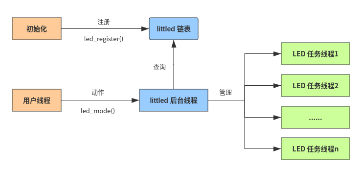

# rtt-littled
Little LED Daemon for RT-Thread


## 1、介绍

littled 是一个基于链表的非常简单易用的 LED 控制软件包。

名字看起来有点奇怪，是 Little LED Daemon 的缩写，意思是小巧的 LED 驱动服务线程。用于帮助处理来自应用线程对 LED 亮、灭、闪烁等控制需求。


### 1.1 特性

- 采用单例模式实现服务
- 异步操作
- 接口简单
- 控制任务线程化
- 线程安全
- 支持中断调用


### 1.2 软件架构



更多 >> <https://blog.csdn.net/lu_embedded/article/details/104565786>


### 1.3 目录结构

| 名称     | 说明       |
| -------- | ---------- |
| examples | 示例目录   |
| inc      | 头文件目录 |
| src      | 源代码目录 |


### 1.4 许可证

littled 软件包遵循 Apache license v2.0 许可，详见 `LICENSE` 文件。


### 1.5 依赖

- RT-Thread 3.0+
- 动态内存管理模块


## 2、获取 littled 软件包

使用 littled package 需要在 RT-Thread 的包管理器中选择它，具体路径如下：

```
RT-Thread online packages --->
    peripheral libraries and drivers --->
        [*] littled: Little LED Daemon for LED driver  --->
```

然后让 RT-Thread 的包管理器自动更新，或者使用 `pkgs --update` 命令更新包到 BSP 中。


## 3、使用 littled 软件包

### 3.1 版本说明

| 版本   | 说明                   |
| ------ | ---------------------- |
| v0.2.0 | 初始版本，实现预期功能 |
| latest | 进一步优化             |

目前处于公测阶段，建议开发者使用 latest 版本。


### 3.2 配置选项

- 周期时间：`PKG_USING_LITTLED_PERIOD`
- 脉冲宽度（高电平持续时间）：`PKG_USING_LITTLED_PULSE`
- 闪烁持续时间：`PKG_USING_LITTLED_BELL_TIME`
- 闪烁次数：`PKG_USING_LITTLED_BEEP_COUNT`

> 时间的单位为毫秒（ms）


## 4、API 说明

### 4.1 注册与取消注册

使用 littled 服务线程的唯一要求是注册 LED，注册接口如下：

```c
int led_register(rt_base_t pin, rt_base_t active_logic);
```

调用这个函数时，会从动态堆内存中分配一个 gp2y10_device_t 句柄，并按给定参数初始化。

| 参数         | 描述                                       |
| ------------ | ------------------------------------------ |
| pin          | LED 引脚                                   |
| active_logic | 有效电平逻辑值（PIN_HIGH/PIN_LOW）         |
| **返回**     | ——                                         |
| LED 描述符   | 注册成功，返回一个大于等于 0 的 LED 描述符 |
| < 0          | 注册失败，返回错误代码                     |

如果您不再需要控制某个 LED 了，可以调用如下接口取消注册，取消注册后再调用控制接口将无效。

```c
void led_unregister(int ld);
```

| **参数** | **描述**   |
| -------- | ---------- |
| ld       | LED 描述符 |
| **返回** | ——         |
| 无       |            |


### 4.2 模式控制

注册成功后，即可调用 led_mode 函数控制 LED 工作。

```c
int led_mode(int ld, rt_uint32_t period, rt_uint32_t pulse, rt_uint32_t time, rt_uint32_t count);
```

| **参数** | **描述**                                                     |
| -------- | ------------------------------------------------------------ |
| ld       | LED 描述符                                                   |
| period   | 周期时间，单位 ms                                            |
| pulse    | 脉冲宽度（高电平持续时间），单位 ms                          |
| time     | 闪烁持续时间，单位 ms                                        |
| count    | 闪烁次数                                                     |
| **返回** | ——                                                           |
| RT_EOK   | 由于采用异步操作，返回 RT_EOK 并不代表完成 LED 控制，因此可不关注返回值 |


### 4.3 宏定义

为方便操作，定义了一些常用控制模式，建议直接使用。

- **LED 亮**

    ```c
    #define LED_ON(ld)
    ```

- **LED 灭**

    ```c
    #define LED_OFF(ld)
    ```

- **LED 翻转**

    ```c
    #define LED_TOGGLE(ld)
    ```

- **LED 提示**

    ```
    #define LED_BEEP(ld)
    ```

- **LED 响铃**

    ```c
    #define LED_BELL(ld)
    ```

- **LED 持续闪烁**

    ```c
    #define LED_BLINK(ld)
    ```

- **LED 持续快闪**

    ```c
    #define LED_BLINK_FAST(ld)
    ```

- **LED 持续慢闪**

    ```c
    #define LED_BLINK_SLOW(ld)
    ```

默认闪烁周期时间为 1 秒，占空比 50%，您可以通过 `scons --menuconfig` 修改 littled 软件包的相关默认配置。


## 5、注意事项

1. pulse 不能大于 period。
2. 新的控制模式会覆盖旧的控制模式，并在下一次修改控制模式前一直保持。


## 6、相关文档

见 docs 目录。


## 7、联系方式

- 维护：luhuadong@163.com
- 主页：<https://github.com/luhuadong/rtt-littled>